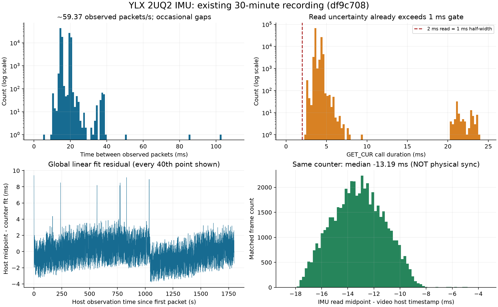

# YLX 2UQ2 IMU：协议、实际数据率、视频同步与标定研究

日期：2026-09-09。研究对象：RDK X5 上的 YLX 2UQ2 双目相机，设备 `192.168.110.248` / `YLX-1C7447D1`。

> **同日真机追加研究的重要修正：** 随后用户授权实际测试，直接保存每次 GET_CUR 的结果，确认同一帧计数器下 24 字节 IMU 载荷仍持续变化。原采集器按帧号去重会丢弃这些数据。因此，本文从既有录制得到的约 59.4 包/s、118.8 行/s，是旧采集器接受并保存的速率，**不是相机 XU 的发布上限**。本文第 6 节关于每秒传出机会的上限推断已被新实验否定；原始离线统计本身仍有效。详情见 [IMU 标称采样率的真机探索](2026-09-09-imu-rate-hardware-experiments.md)。本文以下内容保留原调研时间范围；新实验的操作与结果单独记录。

本次只做资料研究、代码阅读、已有素材的离线分析，以及设备身份的只读查询；没有修改业务代码、重新部署、开启新录制、改变 IMU/相机参数或操作 TRIG 引脚。本文中的改进项与实验步骤是后续建议，不代表已经实现或执行。

源码分析固定到设备已部署版本 `9503e448272e4c6df0942e2c08b05d50d883868e`。研究期间另一个任务正在修改编码业务代码，本文不覆盖、不提交这些改动；精确版本的相关源码副本和哈希另存于研究证据目录。

## 1. 已经可以确定的结论

1. **这是六轴原始测量数据。** 每个 27 字节包包含一个 24 位无符号计数器，以及两组“加速度 XYZ + 角速度 XYZ”。每轴为大端有符号 int16。两组数据并不意味着两颗 IMU，也不能直接解释为两次等间隔采样。
2. **±8 g 对应加速度计，±2000 dps 对应陀螺仪。** 厂商转述中把这两个量程一起写在“陀螺仪”后面，属于表述混用。800/400 Hz 是厂商声称的传感器采样率，不能当成当前 USB 输出率。
3. **既有录制经旧采集器过滤后约 59.4 包/秒，落盘约 118.8 行六轴数据/秒。** 30 分钟素材有 106,886 包、213,772 行；不是上位机获得了完整的 800 Hz 加速度和 400 Hz 陀螺仪序列。后续真机探针已测得约 203 次 GET_CUR/s、406 个返回数据槽/s，不能再把旧落盘速率当作硬件输出上限。
4. **存在计数器未观测位置。** 65 秒素材有 4 个，30 分钟素材有 194 个。生产 Rust 采集器仍固定返回 `dropped_samples=0`，这个字段不能证明 IMU 没有漏读。漏读发生在哪一层仍需实验定位。
5. **同包两组数据使用完全相同的主机时间。** 当前 `host_monotonic_ns` 是 GET_CUR 调用前后时间的中点，不是芯片 ADC 的采样时间，也不是时钟拟合后的重建时间。
6. **视频/IMU 物理同步尚未标定。** 同号数据的主机时间相差约 −13.2 ms，但这个差值不能作为固定补偿量。已有音频时钟亚毫秒级残差，也不能代表 IMU 有同样精度。
7. **原始数据足以继续研究和标定。** 用于一般运动趋势观察有价值；直接作为已标定 SI 单位、严格等间隔、精确同步的 VIO/防抖输入，证据仍不足。

## 2. 证据来源与事实等级

| 来源 | 本次用途 | 能说明什么 | 不能说明什么 |
| --- | --- | --- | --- |
| 用户本次提供的厂商说明文字，记为 V1 | 包布局、量程、采样频率、TRIG 说明 | 厂商对该产品的描述 | 缺少原始文件、版本号、芯片型号及寄存器证据，不能视为所有参数均已实机确认 |
| Conductor `9503e44` 源码 | 读取、解码、落盘和时间处理 | 当前软件实际如何处理数据 | 软件实现正确不等于物理参数和同步精度已验证 |
| `.248` 的 65 秒部署验收素材 | 新整合版的真实数据特征 | 包率、计数器、读取耗时、帧关联等 | 不足以替代六面标定、转台标定、长期温漂实验 |
| `.248` 的 30 分钟 `df9c708` 素材 | 更长时间的统计 | 稀疏计数器跳变、时序分布和稳定性线索 | 未布置独立运动/采样时间基准，不能证明物理同步 |
| Linux UVC 官方文档 | XU 接口机制 | 标准传输调用及元数据语义 | 不定义 2UQ2 厂商载荷、TRIG selector 或采样相位 |
| Kalibr 官方文档 | 设计后续标定方案 | 标定所需的空间、时间与噪声输入 | 不能替本机补出缺失的样本时间戳 |

V1 中的 75 mm 镜头间距和 240 mm 展开尺寸按厂商描述记录。没有实物尺寸图的方向、基准点和公差，本文不反推 IMU 安装位置。广告中的“1080P–4K60、2M–50M、全局、防抖、WIFI/4G”等属于产品系列能力描述，不能据此断言本机每一种能力都存在，尤其不能据此确认本机为全局快门。

本次只读查询确认：相机产品名 `2UQ2`，VID:PID 为 `1bcf:0b15`，`bcdDevice=0701`；RDK API 报告固件 `9503e44`。USB 标识用于定位相机，**不等于 IMU 芯片型号**。

## 3. 采集链路：I²C、UVC、主机各自负责什么

按 V1，IMU 由相机板上的主控通过 I²C 读取。RDK/Windows 上位机通过相机的 USB UVC Extension Unit（XU）获取 27 字节载荷。因此，上位机并不是直接访问本机 I²C 总线上的 IMU 寄存器；芯片内部配置、FIFO、滤波和封包策略都在相机固件里。

| 阶段 | 当前认识 |
| --- | --- |
| IMU 芯片内部测量 | V1 声称加速度 800 Hz、角速度 400 Hz；具体芯片、ODR 寄存器、滤波带宽未知 |
| 相机主控通过 I²C 读取 | V1 确认存在该链路，读取频率、读取方式和 FIFO 策略未知 |
| 相机固件形成 XU 载荷 | 一个计数器加两组六轴值；是否取最新值、FIFO 相邻值、抽取值或平均值未知 |
| 上位机读 XU | 当前实现循环 GET_CUR，接收新的计数器值后保存；重复计数器值继续等待 |
| Conductor 落盘 | 每个接受的包写为两行 `imu.ndjson`，保存原始轴值和主机读取区间 |
| 下游标定/融合 | 还需单位、坐标、各样本采样时刻、视频时间偏移和噪声模型 |

**先开视频**是这款相机的运行条件：V1 要求先启动视频流，IMU 才持续更新。单独打开 `/dev/video0` 文件描述符并读取 XU，并不等于已经执行了视频 STREAMON。

V1 的 Windows 操作方式可以用于厂商工具验证：在 PotPlayer/AMCAP 选择 `2UQ2`，配置 MJPG、3840×1080、60 FPS，启动画面，再使用 UVCXU-V1.9。AMCAP 的 Video Capture Pin 设置按 V1 仅对当前预览有效，重启恢复默认；本次没有在 Windows 上复验该行为。

3840×1080 是左右并排的双目画面，每眼为 1920×1080。Conductor 录制的抽帧配置与相机输入模式要分开看，详见第 6 节。

V1 将音视频和 IMU 总称为经 UVC 同步传输，工程文档需要进一步区分：当前项目视频走 V4L2/UVC，IMU 走 UVC XU，USB 音频走 ALSA 采集接口。共用相机设备、USB 连接或视频开启条件，均不能单独证明这些数据具有相同的采样时钟或延迟。

Linux 的 `UVCIOC_CTRL_QUERY` 根据 unit/selector 访问 XU 控制，载荷内容不会由驱动自动解析成物理量。GET_LEN 用于查询长度，GET_CUR 获取当前控制值；一个控制读取并不是“订阅所有历史 IMU 样本”的保证。[Linux UVC 驱动文档](https://www.kernel.org/doc/html/latest/userspace-api/media/drivers/uvcvideo.html)

## 4. 27 字节协议逐字段说明

### 4.1 布局

偏移从 0 开始。下表的 XYZ 表示原始三个轴的槽位，不代表已确认的相机坐标方向。

| 字节偏移 | 长度 | 字段 | 解码方式 |
| --- | --- | --- | --- |
| 0–2 | 3 | `counter_raw`，当前代码名 `device_timestamp_raw` | 大端 uint24，范围 0–16,777,215 |
| 3–4 | 2 | 第 0 组加速度 X | 大端 int16 |
| 5–6 | 2 | 第 0 组加速度 Y | 大端 int16 |
| 7–8 | 2 | 第 0 组加速度 Z | 大端 int16 |
| 9–10 | 2 | 第 0 组角速度 X | 大端 int16 |
| 11–12 | 2 | 第 0 组角速度 Y | 大端 int16 |
| 13–14 | 2 | 第 0 组角速度 Z | 大端 int16 |
| 15–16 | 2 | 第 1 组加速度 X | 大端 int16 |
| 17–18 | 2 | 第 1 组加速度 Y | 大端 int16 |
| 19–20 | 2 | 第 1 组加速度 Z | 大端 int16 |
| 21–22 | 2 | 第 1 组角速度 X | 大端 int16 |
| 23–24 | 2 | 第 1 组角速度 Y | 大端 int16 |
| 25–26 | 2 | 第 1 组角速度 Z | 大端 int16 |

总长度 `3 + 2 × (3 × 2 + 3 × 2) = 27` 字节。V1 的“后 24 位”“12 位字节”应按**字节**理解，而不是 bit；“速度计”在这里指加速度计，陀螺仪输出的是角速度而不是角度。

载荷没有明确给出每组独立时间戳、温度、量程位、芯片 ID、数据有效位或校验字段。不能仅凭包长度合法判断这些附加事实。

### 4.2 有符号与字节序

两字节先构成无符号数 `u = high × 256 + low`，若 `u >= 32768`，则有符号值为 `u − 65536`。例如 `FF F7` 是 **−9**，不是 65,527。

一个容易混淆的细节：**GET_LEN 返回的两字节长度按小端读取，IMU 数据载荷按大端读取。** 两者属于不同协议层。

仅用于理解的离线解码示例如下；本次没有把它加入业务代码：

```python
import struct

def decode_27_bytes(payload: bytes):
    if len(payload) != 27:
        raise ValueError("expected exactly 27 bytes")
    counter = int.from_bytes(payload[:3], "big", signed=False)
    axes = struct.unpack(">12h", payload[3:])
    return {
        "counter_raw": counter,
        "groups": [
            {"accelerometer_raw": axes[0:3], "gyroscope_raw": axes[3:6]},
            {"accelerometer_raw": axes[6:9], "gyroscope_raw": axes[9:12]},
        ],
    }
```

### 4.3 V1 两个示例的实际解码

示例 1：

```text
00 03 30 05 0C F2 B8 06 E0 00 1B 00 14 00 1D 05 0A F2 B1 06 E2 00 20 00 15 00 1C
```

示例 2：

```text
00 03 48 05 21 F2 C7 07 17 00 05 00 0E 00 11 05 21 F2 C7 07 17 FF F7 00 12 00 0C
```

| 示例 | 计数器 | 组号 | 加速度 XYZ，raw | 角速度 XYZ，raw |
| --- | --- | --- | --- | --- |
| 1 | `0x000330 = 816` | 0 | 1292, −3400, 1760 | 27, 20, 29 |
| 1 | 816 | 1 | 1290, −3407, 1762 | 32, 21, 28 |
| 2 | `0x000348 = 840` | 0 | 1313, −3385, 1815 | 5, 14, 17 |
| 2 | 840 | 1 | 1313, −3385, 1815 | −9, 18, 12 |

两个展示包的计数器差为 24。原图摘录没有说明它们是否相邻，不能据此认定发生了 23 包丢失，也不能把 24 当成正常固定步长。

### 4.4 本机 Linux XU 访问参数

| 参数 | 当前值与依据 |
| --- | --- |
| 视频节点 | `/dev/video0`，实际使用时还应绑定 USB 身份，不能假定节点编号永远不变 |
| IMU XU GUID | `D5C2F42C-1808-4D9F-BE56-753E271C9244`，源码与本次只读 USB 描述符一致 |
| 本机 unit ID | `3`，本次描述符确认；其他固件应重新按 GUID 发现 |
| selector | `1`，已部署采集器使用的参数 |
| 长度请求 | `GET_LEN = 0x85`，请求 2 字节；长度按 little-endian 解码 |
| 数据请求 | `GET_CUR = 0x81`，严格请求 27 字节 |
| Linux ioctl | `UVCIOC_CTRL_QUERY`，按目标平台结构体/头文件定义使用 |
| 重复值等待 | 当前默认 1 ms；这是重复包轮询退避，不是传感器采样周期 |

本次读取的是 sysfs 缓存的 USB 描述符，没有向设备发起新的 XU 数据采集或 SET。描述符还包含 unit 4 的另一 GUID；它的存在不表示该单元就是外触发，也不能从 GUID 自行推导各 selector 功能。

实际读取顺序应为：定位设备和 GUID → 确保视频流已开启 → 查询长度 → 循环读取 27 字节 → 去除重复计数器 → 解码并保留读取区间。应用需有超时与断连处理；不要对未知 selector 扫描试写。

## 5. 量程、单位与坐标

### 5.1 量程目前是厂商声称值

正确写法应为：加速度计量程 **±8 g**，陀螺仪量程 **±2000 °/s（dps）**。800 Hz 和 400 Hz 则分别描述加速度计与陀螺仪的标称采样频率。

假设该相机输出的是完整 16 位二补码，且数字满量程确实对应这两个量程，那么候选换算为：

| 量 | 候选公式 | 每 LSB |
| --- | --- | --- |
| 加速度，以 g 表示 | `a_g = raw × 8 / 32768 = raw / 4096` | 0.000244140625 g |
| 加速度，以 m/s² 表示 | `a_si = raw × 9.80665 / 4096` | 约 0.00239420 m/s² |
| 角速度，以 °/s 表示 | `ω_dps = raw × 2000 / 32768` | 0.06103515625 °/s |
| 角速度，以 rad/s 表示 | `ω_si = raw × 2000 / 32768 × π / 180` | 约 0.00106526 rad/s |

这些是**待确认的理想换算系数**，不是本次标定结果。芯片有效位数、内部缩放、满量程配置、灵敏度公差、轴非正交和偏置均可能影响结果。不能用某一常见芯片的数据手册反推本机型号。

65 秒素材的加速度模长中位数为约 4,157.5 raw；按候选系数约 1.015 g，与重力数量级相容。但没有六面姿态基准，这只能作为一致性线索，不能据此确认比例、偏置或轴向全部正确。该段角速度原始均值约为 `[6.60, 5.68, 16.54]`，也不能不经静止和温度条件确认就写成永久零偏。

### 5.2 原始测量不是位姿

加速度计静止时通常仍测到约 1 g 的比力；求线性加速度时，要通过姿态估计在一致坐标系中处理重力，不能固定减某个 raw 轴上的 4096。角速度积分可估计短时旋转，零偏会积累为角度漂移。没有磁力计或其他绝对方向参考，六轴 IMU 本身不能长期稳定给出绝对航向。

把加速度积分两次也不能直接得到可靠位置。零偏、姿态误差和重力投影误差会迅速积累，需要外部观测约束。

### 5.3 三个坐标系必须分开

当前 manifest 明确使用：

- 图像相机坐标：`opencv_optical`。
- IMU 原始坐标：`raw_device_axes`。
- 主机单调时间：`host_monotonic`，它是时间域，不是空间坐标系。

IMU XYZ 的实际方向、正负号和手性还需确认。相机的 75 mm 双目基线不是 IMU 到左目或右目的位置向量。双目外参、IMU–相机旋转 `R_CI` 和平移 `p_CI` 是不同的参数。

后续可用 `a_C = R_CI M_a(raw_a − b_a)` 和 `ω_C = R_CI M_g(raw_g − b_g)` 表达校正与旋转。若有明显杆臂距离和快速转动，加速度还受角加速度与向心项影响；只有方向旋转不足以描述两个安装点的加速度关系。

## 6. 实测数据率与计数器行为

### 6.1 分析对象与算法

本次读取既有 `manifest.json`、`imu.ndjson` 和 `frames.ndjson`，重新验证两个索引文件的 SHA-256 与 manifest 一致。先检查每个包确实有组 0/1 两行，再按包去重统计时间和计数器。

| 项目 | 65 秒整合版录制 | 30 分钟历史录制 |
| --- | --- | --- |
| 固件 | `9503e44` | `df9c708` |
| session | `01a08557-d9a0-725e-89fa-5e61891bdf58` | `01a0817e-2adc-788b-8a2d-08348beba80e` |
| IMU 首末包主机观测跨度 | 65.495410 s | 1800.328718 s |
| 读取包数 | 3,893 | 106,886 |
| 落盘六轴数据行数 | 7,786 | 213,772 |
| 包到达平均率 `(N−1)/span` | 59.424012 Hz | 59.369713 Hz |
| 行数等效率 `2×(N−1)/span` | 118.848023 行/s | 118.739427 行/s |
| 计数器相对主机的全局拟合增长率 | 59.476945 /s | 59.477159 /s |
| 落盘双目视频帧对数 | 1,949 | 53,540 |
| 落盘视频实际帧率 | 29.737809 fps | 29.738603 fps |
| 视频 `source_sequence` 步长 | 全部为 2 | 全部为 2 |

“行数等效率”只是单位时间保存的数据组数量，**不是已经验证的均匀采样率**。同包两行共享时间，真实组内相位未知。统计用 IMU 首末包观测跨度，不使用包含启动/封存时间的 session 总生命周期。

相机配置为标称 `sensor_fps=60`、`frame_decimation=2`、`nominal_fps=30`。这解释了为什么源帧计数器约 59.477/s、录制约 29.739 fps。看到 `source_sequence` 每次加 2，在这个抽帧配置下属于正常行为，不能算作额外视频丢帧。

原离线分析曾把 59.477 包/s 推断为约 118.954 组/s 的传出机会。**后续真机实验已否定这个上限推断：相同帧号下 IMU 载荷仍会变化。** 这里的 118.954 只描述按帧号去重后的数据组机会；实际可读取更多响应。没有 FIFO/滤波说明，仍不能假设这些值已完成正确的低通降采样，也不能通过上位机插值恢复缺失的高频信息。

### 6.2 未观测计数器位置

| 计数器步长 | 65 秒包间出现次数 | 30 分钟包间出现次数 |
| --- | --- | --- |
| 1 | 3,890 | 106,699 |
| 2 | 1 | 183 |
| 3 | 0 | 1 |
| 4 | 1 | 0 |
| 5 | 0 | 1 |
| 6 | 0 | 1 |

65 秒里有 2 次跳变，共 **4 个未观测计数器位置**；30 分钟里有 186 次跳变，共 **194 个未观测位置**。后者占该计数器覆盖区间内位置总数的约 **0.181%**。

这可以证明保存序列没有覆盖区间内的每个整数位置。结合 V1 的“帧序号”说明以及主体步长为 1，漏读或未交付包是合理的重点假设；仍不能据此断言 USB 总线实际丢了多少包，更不能直接推算芯片丢了多少次 ADC 采样。固件缓存覆盖、主控读取策略、主机轮询与调度、写盘争用都可能参与。

当前 Rust `State::read` 对每个接收包把本地 `packet_sequence` 加 1、`sequence` 加 2，并固定填 `dropped_samples: 0`。因此本地序号完全连续，只能说明已接受数据的编号连续，不能否定设备计数器的缺口。Python 参考采集器能接收外部 `lost_packets`，但这不是生产 Rust 路径已经自动识别缺口的证据。

### 6.3 包内相同读数

| 指标 | 65 秒 | 30 分钟 |
| --- | --- | --- |
| 两组主机时间相同 | 100% | 100% |
| 两组设备计数器相同 | 100% | 100% |
| 两组加速度三轴完全相同 | 0.796% | 1.198% |
| 两组角速度三轴完全相同 | 63.627% | 63.331% |

角速度两组值完全相同的比例很高。可能原因包括传感器更新相位、读取两次时寄存器没有更新、固件重复填值，以及运动很小加上数字量化。**仅凭相同值比例不能确定是哪一种，也不能直接宣布有 63% 的无效样本。** 应用受控动态输入，并向厂商确认两组样本的形成方式。

### 6.4 24 位回绕

计数器模数是 `2^24 = 16,777,216`。如果按当前约 59.477/s 连续增长且中途不复位，一次完整回绕约需 **78.355 小时，即约 3.26 天**。这两段素材均未出现真实回绕。

因此旧实验手册中“5–10 分钟或足够覆盖回绕”的前半句，在本机实测计数率下不够。已有软件回绕测试只证明算法能处理合成边界，不能代替真实设备跨回绕证据。

当前展开算法使用 `delta = (raw_new − raw_old) mod 2^24`，零增量视为停滞，超过半模数的增量视为回退。它不能仅凭两个值完全区分回绕、设备重启、视频流重启或长时间断流；后续必须结合流/会话边界和实际时间间隔判断。

## 7. 当前时间戳到底表示什么

### 7.1 一个包涉及的不同时间

| 字段或物理时刻 | 含义 | 当前是否直接知道 |
| --- | --- | --- |
| IMU ADC 采样时刻 | 加速度/角速度在芯片内部产生测量的时刻 | 不知道 |
| 相机 I²C 读取时刻 | 主控读取 IMU 寄存器/FIFO 的时刻 | 不知道 |
| XU 载荷更新时刻 | 固件把两组值和计数器发布到可读载荷的时刻 | 不知道 |
| `device_timestamp_raw` | 包首 24 位序号，名称沿用代码 | 知道整数值，不知道绝对采样相位 |
| `device_ticks` | 对上述序号做回绕展开后的数值 | 知道算法结果，不表示已确认单位为秒或微秒 |
| `host_read_start_ns` / `host_read_end_ns` | 主机 GET_CUR 调用前后 CLOCK_MONOTONIC 时间 | 知道 |
| `host_monotonic_ns` | 上述区间中点 | 知道，但不是独立样本采样时间 |
| 视频 `host_monotonic_ns` | 优先使用 V4L2 标为 MONOTONIC 的时间戳，否则使用主机时间回退 | 知道保存值，未证明其与曝光开始/中心的精确关系 |

当前代码对包内组 0、组 1，均赋值：

```text
t_host = (host_read_start_ns + host_read_end_ns) / 2
t_group0 = t_host
t_group1 = t_host
```

这保留了真实读取证据，没有伪造组间隔；代价是下游不能直接把两行当成严格递增时间序列。按时间排序不会解决重复时间，给第二组机械加 1 ns 或加 8.33 ms 也不会产生真实采样相位。

### 7.2 当前拟合与质量标签

生产 Rust 时间同步器以最近最多 64 个包拟合：

```text
host_midpoint ≈ offset + scale × unwrapped_counter
saved_residual = max_window(|host_midpoint − prediction|)
                 + max_window((read_end − read_start) / 2)
```

至少需要 3 个包；此前标记 `insufficient`。残差预算不超过 1 ms 时标记 `good`，超过时标记 `degraded`。`offset_ns` 是计数器对主机拟合直线的截距，**不是“IMU 比视频慢多少”的补偿量**。生产保存的 `host_monotonic_ns` 仍然是原始读取中点，未替换成拟合预测。

| 指标 | 65 秒整合版 | 30 分钟历史版 |
| --- | --- | --- |
| 单次 GET_CUR 耗时中位数 | 3.662 ms | 3.630 ms |
| 单次 GET_CUR 耗时 P95 | 4.510 ms | 4.494 ms |
| 单次 GET_CUR 耗时最大值 | 5.874 ms | 23.798 ms |
| 包间观测间隔 P50 / P95 | 15.416 / 20.534 ms | 15.405 / 20.488 ms |
| 包间观测间隔最大值 | 71.053 ms | 102.640 ms |
| 全局线性拟合绝对残差 P95 | 2.551 ms | 2.908 ms |
| 全局线性拟合绝对残差最大值 | 7.996 ms | 9.406 ms |
| 落盘滑动窗口残差预算 P95 | 6.315 ms | 5.982 ms |
| 落盘滑动窗口残差预算最大值 | 9.613 ms | 20.278 ms |
| 包级 `insufficient` / `degraded` / `good` 数量 | 2 / 3,891 / 0 | 2 / 106,884 / 0 |

全局拟合数值是本次对整段数据重新做的最小二乘分析；滑动窗口数值是文件中原有 `sync.residual_ns`。两者窗口、计算目标和不确定度处理不同，不能把其中较小的值当成另一算法已优化后的效果。

这两段素材的最短 GET_CUR 耗时分别约 2.692 ms 和 2.498 ms。仅区间一半就超过 1 ms，所以对这些观测，当前 `good` 阈值实际上无法满足。这解释了为什么即使运行平稳，所有进入拟合阶段的包仍显示 `degraded`。

调整标签阈值可以改善诊断解释，但不会缩短 USB 调用，不会识别 ADC 采样时刻，也不会改善实际视频/IMU 同步。后续应将“传输读取不确定度”“计数器拟合稳定性”“物理同步标定误差”分开报告。



图中第三幅仅每 40 个点绘制一个点以便观察，表格统计使用全部数据。第四幅的负偏移是两个主机时间标记之差，不是物理同步测量。

### 7.3 不同设备的主机单调时间不能直接相减

本机 CLOCK_MONOTONIC 对视频、IMU、音频提供一致的主机时间域，但其他 RDK、手机或电脑的单调时钟有不同原点和频率误差。多设备融合需要事件对齐或独立公共时基；给数据写上同一种字段名、NTP 时间或相同帧率，不会自动解决亚帧级同步。

## 8. 视频帧号关联：已有很强线索，仍缺物理相位

V1 说序号与帧数据关联。代码中的视频 `source_sequence` 来自 V4L2 buffer 的 sequence，IMU 计数器来自 XU 包首 3 字节。两者是不同接口提供的数字；当前落盘没有另存一个“厂商载荷内嵌视频帧号”的独立字段。

本次将视频 `source_sequence` 与 IMU 原始计数器取**整数相等**匹配：

| 项目 | 65 秒 | 30 分钟 |
| --- | --- | --- |
| 找到同号 IMU 的视频帧 | 1,946 / 1,949 | 53,352 / 53,540 |
| 同号 `t_IMU_host − t_video_host` 中位数 | −13.112 ms | −13.192 ms |
| 同号差值 P95 | −9.815 ms | −9.937 ms |
| 同号差值范围 | −17.687 至 −7.928 ms | −18.727 至 −3.395 ms |

这说明两段流中存在很强的共同序列关联，支持进一步研究基于计数器的帧关联方法。它不证明任意固件、视频重启、分辨率、抽帧模式或系统启动后都具有固定零偏编号关系。

负差值表示 XU 调用中点早于同号视频的保存时间戳。合理解释包括 XU 载荷在视频传输完成前已可读、V4L2 时间戳代表的事件较晚，或相机内部采样/封包相位不同。仅凭现有数据无法区分。

**不能直接统一加 13.2 ms。** 这样会让同号主机时间看起来更接近，却可能把真实采样时刻移错。与此前音频 +30 ms 的特定素材校准同理，测量对象、时钟映射和物理事件必须匹配，不能跨传感器套用常数。

可进一步验证的模型是：

```text
camera_frame_time(k) ≈ a + b × counter(k)
IMU_sample_time(k, j) ≈ camera_exposure_reference(k) + phase(j)
```

其中 `phase(j)` 必须由厂商说明或实验确认。加速度与陀螺仪内部 ODR 不同，还可能需要 `phase_accel(j)` 和 `phase_gyro(j)`，不能默认一个组内六轴均为同一时刻。

## 9. 当前实现逐项评价与后续改进方向

这些是研究结论，**本次没有实施修复**。

| 项目 | 当前实现/观察 | 后续建议 |
| --- | --- | --- |
| 包边界与数值解码 | 严格 27 字节、uint24 + 大端 int16，两组保存 | 保留；增加厂商示例作为未来回归样本 |
| XU 发现 | 按 USB 描述符中的 GUID 寻找 unit；selector=1 | 继续以 GUID/设备身份定位，避免把 unit=3 当成所有硬件固定值 |
| 重复包处理 | 相同计数器继续轮询，重复等待约 1 ms | 未来单独记录重复读取次数、读取耗时与包更新节奏 |
| 设备计数器缺口 | raw 值保留，但原生 `dropped_samples` 固定为 0 | 在证实计数器语义后统计缺口、区分复位/回绕/未观测；先报告缺口，避免臆算 ADC 丢样数 |
| 包内两组时间 | 两行共用中点 | 在相位未确认前继续保留原始证据；额外的重建时间应与原始时间分字段表达 |
| 同步质量 | 读取半区间加拟合误差，与 1 ms 阈值比较 | 拆分传输、拟合、物理同步三个维度；不要仅调阈值制造“good” |
| 生产 IMU 线程 | 每次读完同步写入 RecordingSink，再读下一包 | 测量写入/锁等待与计数器缺口相关性，再决定是否需要小型有界队列 |
| 原始量与坐标 | `raw_int16`、`raw_device_axes` | 保留不可变原始数据；标定量作为带版本和来源的派生数据 |
| 对外导出 | 有两行相同时间、无确定 SI 比例与外参 | 提供研究格式说明；正式 VIO 适配须先解决时间、单位和轴向 |

源码定位：[`native/src/imu.rs`](../../native/src/imu.rs)、[`native/src/capture_runtime.rs`](../../native/src/capture_runtime.rs)、[`native/src/v4l2.rs`](../../native/src/v4l2.rs)、[`protocol.py`](../../src/rp_ylx/imu/protocol.py)、[`time_sync.py`](../../src/rp_ylx/imu/time_sync.py)、[`device_session.py`](../../src/rp_ylx/recording/device_session.py)。链接指向工作区，精确已部署版本另见第 14 节快照。

**不要把“更快轮询”直接当成提高传感器采样率。** 当前成功 GET_CUR 一次就常需 3–5 ms；更频繁读取可能只是增加重复包和 USB 控制负担。若固件只有“最新值”缓存，上位机无法读回已被覆盖的历史样本。若确有 FIFO/批量接口，完整获得内部数据首先取决于厂商是否开放它。

当前原生循环的结构为“读取 → 获取 sink 锁 → 写入两组 → 下一次读取”。在某些调度或写盘条件下，这种串行等待可能扩大读取间隔；现有时序数据只能把它列为待验证假设，不能直接把全部 194 个缺口归咎于写盘。

## 10. 外触发能解决什么，不能解决什么

### 10.1 已有说明

V1 声称主板有 `TRIG1` / `TRIG2`、sensor 板有 `TRIG`；外部 PWM 可用于曝光触发，逻辑电平为 **1.8 V**，触发频率上限为相机自身帧率。模式 0 为常规视频，模式 1 为手动外触发。

缺少原图和电气/协议完整说明，尚不能确认：引脚物理位置、连接器脚序、输入输出方向、有效边沿、最短脉宽、占空比要求、过压容忍、TRIG1/2 与左右目的对应、是否可并接、触发到曝光的延迟、曝光期间能否再次触发、失触发后的超时行为。

“标准 UVC 接口可控制开关”可能表示使用标准 XU 传输机制承载厂商控制；它没有给出可执行的 unit/GUID/selector/长度/SET_CUR 数据。不能猜一个 selector 后试写 0/1。

项目当前 XU 访问策略禁用 SET，并特别拒绝 unit 4 的 selector 10/15 的 GET_CUR。这里仅记录现有行为；本文没有探测这些接口，也没有试开外触发。

### 10.2 对同步的实际帮助

| 目标 | 外触发可能带来的帮助 | 仍需补齐的证据 |
| --- | --- | --- |
| 左右相机同步曝光 | 两路曝光由共同信号控制 | 两路触发映射、sensor 响应、延迟和抖动实测 |
| 多台相机同步曝光 | 同一触发源分发到多台设备 | 电气条件、分配偏斜、触发 ID 与视频帧对应 |
| 视频与 IMU 同步 | 如果固件同时锁存 IMU/FIFO 与触发序号，可建立关联 | V1 尚未承诺这种锁存，需确认采样相位和是否有 FSYNC/DRDY 机制 |
| 音频同步 | 可把公共触发事件引入可观测音频/时间轨 | TRIG 本身不等于控制 USB 音频采样时钟 |
| 更高 IMU 数据率 | 没有直接保证 | 是否输出内部完整样本、是否开放 FIFO/批量传输 |

若降低视频触发频率，而 IMU 发布确实依赖帧事件，上位机 IMU 包率还可能随之下降；这是后续实验必须检查的条件，不是本次已验证现象。

电气实验应使用满足厂商要求的 1.8 V 驱动与电平转换，确认方向和共地后再连接；**不能将 3.3 V/5 V GPIO 直接视为兼容**。当前没有引脚容忍度资料，也没有接线或外触发实测结果。

## 11. 建议的研究与标定实验顺序

### 11.1 第一阶段：补齐协议事实

先向厂商索取第 13 节的问题答案和原始文档，尤其是芯片型号、两组样本来源、帧号含义与复位条件。可并行做以下离线/低侵入研究：

1. 对已有更多会话重复本文统计，比较每包计数器、两组值差异、计数器缺口与录制条件。
2. 在未来独占采集窗口，记录每次 XU 读取的起止时间、重复计数器、写入耗时和缺口位置；按时间关联缺口前后的等待。
3. 对比仅预览+读取、录制+读取、不同负载的包率与缺口。不通过多开摄像头播放器争用同一视频节点来做性能比较。
4. 分别记录视频流启动、正常停止再启动、相机重连后的计数器起点；每种情况建立新时间映射，不把复位误判成回绕。

这里的目标是解释数据如何到达，而不是仅让平均包率数值增大。多轮结果一致后，再决定是否需要改业务采集线程或相机固件。

### 11.2 第二阶段：单位、轴向与偏置

**六面静置**：把相机刚体的六个方向分别朝上，逐面保留照片/视频和 10–20 秒数据，舍弃刚放稳的过渡段。每个轴的正反面均值可初步得到偏置和比例：

```text
b_i ≈ (mean_i_positive + mean_i_negative) / 2
counts_per_g_i ≈ |mean_i_positive − mean_i_negative| / 2
```

六个方向用于确认原始轴的映射与正负号。要拟合完整交叉轴/非正交误差，建议增加多个倾斜静止姿态，并记录可追溯的姿态参考，避免只凭“看起来放平”宣布高精度。

**陀螺仪静置和已知角速度**：先预热并做静置序列估计零偏，再按 XYZ 正反向以已知角速度转动，使用转台或已标定视觉姿态提供外部参考。做多个速度和重复试验，拟合比例、方向和交叉轴耦合，避免手转一圈就认定量程已校准。

**温漂与噪声**：在稳定固定姿态下做较长静置，记录环境及设备温度条件。该 27 字节载荷没有明确的温度字段，RDK CPU 温度不能代替 IMU 芯片温度。已有长录含明显运动，不能直接当成纯静态 Allan 分析素材。噪声密度与偏置随机游走须从合适数据估计，不能从 ±8 g/±2000 dps 量程推算。[Kalibr IMU 噪声模型](https://github.com/ethz-asl/kalibr/wiki/IMU-Noise-Model)

### 11.3 第三阶段：两组样本相位

给相机刚体施加可重复、频率和相位可参考的周期运动，同时记录 IMU 与外部视觉/转台信号。分别分析组 0、组 1 的加速度和角速度：

- 两组是否有稳定先后关系，组间延时是多少；
- 相同值比例在静止、慢运动和较快运动下如何变化；
- 两组是相邻采样、不同抽取相位、同一寄存器重复读取，还是滤波结果；
- 更改视频模式或触发节奏后，组内相位与更新频率是否变化。

在相位未确认前，可以将每包视为一个具有读取区间的观测容器；不要简单把两组平均后宣布得到精确单样本，也不要默认按 1/400 或 1/800 秒拆开它们。

### 11.4 第四阶段：相机—IMU 联合空间和时间标定

优先使用固定 AprilGrid，让相机和 IMU 所在的**整个刚体一起运动**。光照充足、曝光短，包含多方向平移和转动，保存视频原始帧时间、IMU 原始记录和标定参数。完成图像内参、IMU 单位/轴向及样本时间处理后，再拟合 IMU–相机外参和时间偏移。

Kalibr 支持相机与 IMU 的空间/时间联合标定，并强调输入 IMU 内参、噪声参数、同一时钟域及低抖动时间戳。它也明确提醒批量发布形成的异常时间间隔会导致标定问题。因而不能把当前成对相同时间的行直接包装成 ROS IMU 就认为准备完成。[Kalibr 相机–IMU 标定](https://github.com/ethz-asl/kalibr/wiki/camera-imu-calibration)

若先做简单共同事件实验，应至少有约 20 次可重复事件，并保证**事件真的激励到相机上的 IMU**。例如在相机刚体上做可见的转动、轻微机械激励，或使用已知运动平台。只拍桌面上移动的物体、闪灯或拍手，而相机固定不动，不能形成相应的刚体 IMU 运动事件。

此前用手机拍同一物体的方法适合研究视频/音频事件，但不能自动给固定相机的 IMU 提供同步真值。手机若作为运动参考，要与该相机刚性固定，并处理手机自身时间偏移、相对姿态和杆臂。

最后应报告训练/拟合事件与独立保留事件的误差，检查固定时间偏移是否足够，还是还存在时间漂移、曝光相关延迟和运动方向相关误差。30 fps 视频帧间约 33.6 ms，仅凭逐帧人工定位不应宣称亚毫秒物理同步。

### 11.5 验收目标的使用方式

已有 [OpenAria Score IMU 物理验收手册](../../../openaria-score/docs/IMU_PHYSICAL_ACCEPTANCE_RUNBOOK.md) 给出项目门槛，例如六面重力残差 P95 ≤0.15 m/s²、已知角速度比例误差 ≤5%、至少 20 次共同事件、读取耗时 P95 ≤10 ms，并要求真实回绕和样本相位证据。它们是项目验收约定，**不是厂商保证指标**。

本次数据虽然满足部分传输/拟合统计量，也没有完成其物理验收要求；不能据此填写 `CAP-PHY-03/04=PASS`。真实回绕按当前增长率需约 78 小时，应单独安排，不能把合成回绕或十分钟短测充当完成。

## 12. 当前适用范围

| 用途 | 当前评价 | 首要前提/缺口 |
| --- | --- | --- |
| 设备是否运动、粗略运动趋势 | 可以开展原始数据分析 | 阈值需结合偏置和场景，避免把 raw 当 SI |
| 低频姿态/重力方向研究 | 可以做有明确假设的实验 | 轴向、比例、零偏、重力与运动加速度分离 |
| 高质量电子防抖 | 暂无足够完成证据 | 角速度标定、相机内参、曝光与逐行读出模型、物理时间相位 |
| VIO / SLAM | 可以作为待标定数据源研究，不是开箱即用的已标定输入 | SI 单位、严格样本时间、相机–IMU 外参、缺口处理、噪声模型 |
| 振动频谱与高频运动测量 | 不宜按 400/800 Hz 输出能力使用 | 当前传出率、组内相位、滤波/混叠与重复读数机制未知 |
| 无人机闭环飞控 | 本研究不支持该能力结论 | 控制带宽、确定性延迟、故障模式与独立可靠性要求均未验证 |
| 多台设备 IMU 同步 | 尚未完成 | 各主机时基映射、共同运动/事件、长期漂移 |

VIO 能否取得可用效果不能只由“有约 119 行/s”判定。许多场景还取决于运动速度、图像质量、视差、特征、时间精度和估计器设计。提高上位机插值率不会增加独立测量信息。

## 13. 建议向厂商索取的具体问题

这份清单可以直接用于后续沟通；本次未向厂商发送消息。

| 类别 | 需要厂商明确回答的问题 |
| --- | --- |
| 芯片 | IMU 的完整型号、硬件版本、是否只有一颗、能否提供 datasheet 和当前寄存器配置？ |
| 量程 | ±8 g / ±2000 dps 是否为这台设备当前固件的实际值？精确 LSB/g、LSB/(°/s)、有效位数、原始二补码及是否有固件缩放？ |
| ODR 与滤波 | 800/400 Hz 是芯片 ODR、主控读取率还是对外发布率？数字低通、抽取、平均、FIFO 和抗混叠如何配置？ |
| 两组样本 | 是否来自同一 IMU？组 0/1 是否按时间先后？各组加速度和角速度是否同一时刻？分别距离帧事件多久？ |
| 计数器 | 是 sensor 帧号、UVC 帧号还是固件包号？何时加 1、何时清零、如何回绕？是否与 V4L2 sequence 有明确映射保证？ |
| XU 缓存 | GET_CUR 返回最新值还是弹出 FIFO？相同序号下轴值会不会更新？多次读取会不会消费数据？是否有遗漏计数或批量接口？ |
| 固件数据完整性 | 能否得到完整 800/400 Hz 样本与独立硬件时间戳？当前约 59.4 包/s 是否符合设计？ |
| 坐标与安装 | 加速度/陀螺仪各轴方向图、正方向、手性、IMU 到左右 sensor 光心的机械位置与公差？ |
| 曝光时间 | 帧号对应曝光开始、中心、结束还是 USB 输出？sensor 型号、快门类型、行读出时间、自动曝光是否改变相位？ |
| 外触发接口 | GUID/unit/selector/请求长度/0和1的完整示例、GET_INFO 支持、是否持久化、恢复常规流的方法？ |
| 外触发电气 | TRIG1/2/板端 TRIG 脚位、输入输出方向、1.8 V 电平阈值、最大电压、有效边沿、最短脉宽、共地、左右目的关系？ |
| 外触发与 IMU | 是否锁存 IMU 样本/时间戳，是否支持 FSYNC/DRDY，减慢触发是否降低 IMU 输出率，如何标识漏触发？ |
| 温度与校准 | 是否提供温度读数、出厂标定、零偏温漂、噪声密度和偏置稳定性测试？ |

## 14. 数据、复现与引用

完整离线研究目录：`/data2/openaria-imu-study-20260909/`。

- [统计结果 JSON](assets/2026-09-09-imu-study/analysis.json)：文中两个会话的完整指标、来源文件 SHA-256、厂商示例解码。
- [时序图 PNG](assets/2026-09-09-imu-study/imu-timing.png) / [SVG](assets/2026-09-09-imu-study/imu-timing.svg)。
- 离线分析脚本：`/data2/openaria-imu-study-20260909/analyze_existing.py`；绘图脚本：同目录 `plot_results.py`。它们位于研究证据目录，不属于产品业务代码。
- 精确源码副本：同目录 `source-9503e44/`；来源和只读设备观察：`provenance.json`。
- 本次只读 USB 描述符：同目录 `device-xu-descriptors.json`，确认 IMU GUID 对应 unit 3。
- 65 秒原始数据：`/data2/openaria-deploy-248-20260909/export/YLX-1C7447D1/01a08557-d9a0-725e-89fa-5e61891bdf58/.openaria/source/`。该测试录制已在前一部署任务中从设备删除，本地原始文件仍完整保留。
- 30 分钟原始数据：`/data2/openaria-phone-sync-20260908/long-recording/`。

复现命令只读取已有素材并更新离线研究结果，不连接或控制设备：

```bash
shnote --what "复算已有 IMU 素材" --why "核对协议与时序研究结果" run \
  uv run --no-project --with numpy python \
  /data2/openaria-imu-study-20260909/analyze_existing.py
```

统计定义：包率采用 `(包数−1)/(最后包中点−第一包中点)`；行数等效率为其两倍；全局拟合先减首个计数器和首个主机时间再做最小二乘；P95 使用 NumPy 百分位；缺口数为所有正向 `delta−1` 的和；包内比较仅比较同包组 0/1；视频关联仅比较相同整数序号。两段数据均未回绕，本文的同号关联没有经过跨回绕或跨重启泛化。

外部资料核对日期：2026-09-09。

- [Linux Kernel：UVC driver / UVCIOC_CTRL_QUERY](https://www.kernel.org/doc/html/latest/userspace-api/media/drivers/uvcvideo.html)。
- [ETH Zürich ASL：Kalibr Camera–IMU calibration](https://github.com/ethz-asl/kalibr/wiki/camera-imu-calibration)。
- [ETH Zürich ASL：Kalibr IMU Noise Model](https://github.com/ethz-asl/kalibr/wiki/IMU-Noise-Model)。
- 厂商来源 V1：用户在本次会话提供的产品与协议说明转录；本次没有取得或宣称取得相机厂商原始 PDF、UVCXU 源码库或 IMU 芯片手册。
